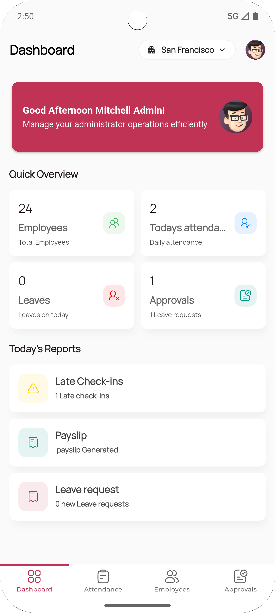
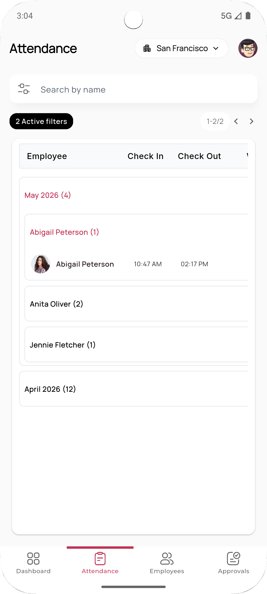
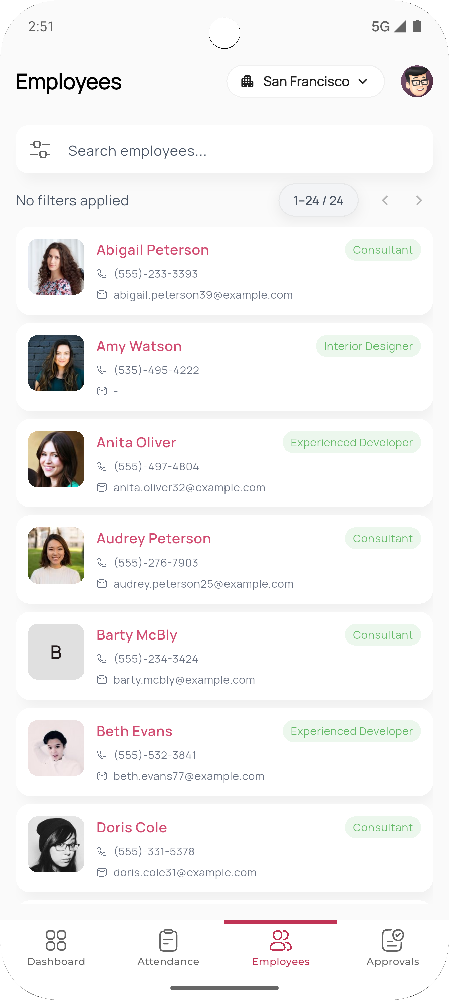
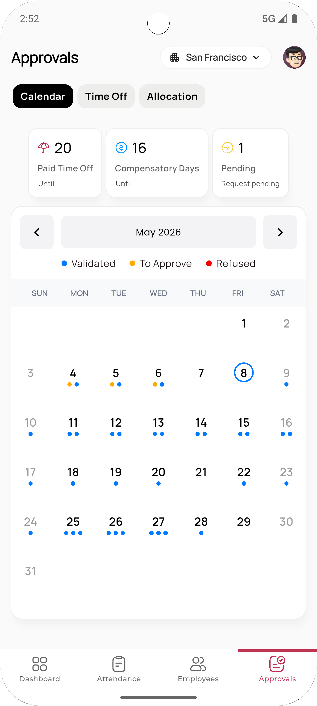

# Mobo Employee


Mobo Employee is a professional mobile companion for Odoo HR, designed to seamlessly integrate with Odoo and empower organizations to manage their workforce with efficiency and precision. Built with Flutter, it offers a high-performance, intuitive interface for tracking attendance, managing leaves, handling approvals, and maintaining employee profiles directly from your mobile device.

##  Key Features

###  Comprehensive Employee Self-Service
- **Personal Dashboard**: Snapshot of attendance status, leave balances, and HR insights at a glance.
- **Profile Management**: View and update personal employee details on the go.
- **Real-Time HR Sync**: Instant data exchange with the Odoo HR backend.

###  Attendance Management
- **Check-In / Check-Out**: Record working hours with a single tap from anywhere.
- **Attendance History**: Full audit trail of past check-ins, hours, and overtime.
- **Smart Filtering**: Quickly locate specific attendance records by date or status.

###  Leave Management
- **Leave Requests**: Apply, track, and review leave applications in real time.
- **Leave Balances**: Monitor allocations and remaining days across leave types.
- **Attachments**: Upload supporting documents directly with leave submissions.
- **Status Tracking**: Stay informed on approval progress for every request.

###  Manager Tools & Approvals
- **Manager Dashboard**: Consolidated view of team attendance, pending approvals, and HR metrics.
- **Approvals Workflow**: Review, approve, or refuse leave requests with calendar visualization.
- **Team Attendance**: Monitor attendance records across team members in real time.
- **Employee Directory**: Browse, search, and manage employees reporting to you.
- **Time-Off Allocation**: Assign and manage time-off allocations for team members.

###  Security & User Experience
- **Biometric Authentication**: Secure and fast login using Fingerprint or Face ID.
- **2-Factor Authentication (2FA)**: Support for Time-based One-Time Password (TOTP) for enhanced security.
- **App Lock**: Additional in-app lock screen to safeguard sensitive HR data.
- **User Access Control**: Permission-based access governed by Odoo's user group settings.
- **Role-Based Experience**: Tailored interface for Employee and Manager user types.
- **Switch Account**: Quickly swap between multiple Odoo accounts and databases.
- **Multi-Company Support**: Easily switch between different company profiles.
- **Dark Mode**: Fully optimized dark theme for comfortable usage.
- **Performance**: Optimized with pagination and domain-based filtering for large datasets.

##  Screenshots


<div>
  
  
  
  
</div>


##  Technology Stack

Mobo Employee is built using modern technologies to ensure reliability and performance:

- **Frontend**: Flutter (Dart)
- **State Management**: Provider
- **Local Storage**: Shared Preferences & Flutter Secure Storage
- **Backend Integration**: Odoo RPC
- **Authentication**: Local Auth (Biometrics) & Odoo Session Management
- **UI Toolkit**: Google Fonts, HugeIcons, Lottie, Shimmer, Table Calendar, Snake Navigation Bar

##  Supported Odoo Versions

- Tested with **Odoo v17, v18 and v19**.
- Recommended: **Odoo v17+** for optimal performance.

##  Getting Started

### Prerequisites
- Flutter SDK (Latest Stable, Dart SDK ^3.9.2)
- Odoo Instance (v17 or higher recommended)
- Android Studio or VS Code

### Installation

1. **Clone the repository**
   ```bash
   git clone https://github.com/mobo-open-source/mobo_employee.git
   cd mobo_employee
   ```

2. **Install dependencies**
   ```bash
   flutter pub get
   ```

3. **Run the application**
   ```bash
   flutter run
   ```

##  Usage

To get started with Mobo Employee:

1. **Open the App**: Launch Mobo Employee on your mobile device.
2. **Setup Server**: Enter your Odoo server URL.
3. **Select Database**: Choose the appropriate database for your company.
4. **Login**: Enter your Odoo credentials (including 2FA if enabled).
5. **Start Managing**: Begin managing your attendance, leaves, and team approvals efficiently.

##  Roadmap

Future improvements planned for Mobo Employee:
- [ ] **Offline Support**: Enable work without internet with automatic synchronization.
- [ ] **Push Notifications**: Real-time alerts for approval requests and leave status updates.
- [ ] **AI Support**: Intelligent leave suggestions and HR insights powered by AI.

##  Contributing

We welcome contributions to improve Mobo Employee!
1. Fork the project.
2. Create your feature branch (`git checkout -b feature/NewFeature`).
3. Commit your changes (`git commit -m 'Add NewFeature'`).
4. Push to the branch (`git push origin feature/NewFeature`).
5. Open a Pull Request.

##  Maintainers

**Team Mobo at Cybrosys Technologies**
- Email: [mobo@cybrosys.com](mailto:mobo@cybrosys.com)
- Website: [cybrosys.com](https://www.cybrosys.com/mobo/)

## License

This project is primarily licensed under the Apache License 2.0.
It also includes third-party components licensed under:
- MIT License
- GNU Lesser General Public License (LGPL)

See the [LICENSE](LICENSE) file for the main license and [THIRD_PARTY_LICENSES.md](THIRD_PARTY_LICENSES.md) for details on included dependencies and their respective licenses.
